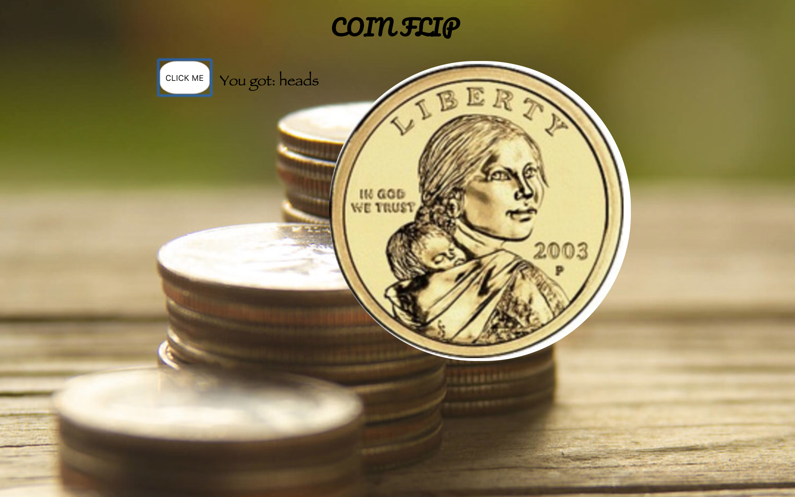

# Coin Flip Project
I created a coin flip guessing game web application that uses the fs and http modules. I used the http to create the server and fs to read your html file. I also included in the vanilla ES6 js in a script tag at the bottom of my html file.

The most painful part when creating my code was trying to get the images to appear while running the site off of my local server. I received a CORB error, which I have not encountered before. I attempted to research the answer online but wasn't getting further along in the process. I then decided to reach out for help on the slack. It turns out in my javascript, the img source I was using was linking to the HTML that frames the image
(img scr = "https://i.ibb.co/Jzk0ckc"), not to the actual image. Once I changed to img src to https://i.ibb.co/Jzk0ckc/heads.png my images started to appear.

## How It's Made:

**Tech used:** HTML, CSS, JavaScript
